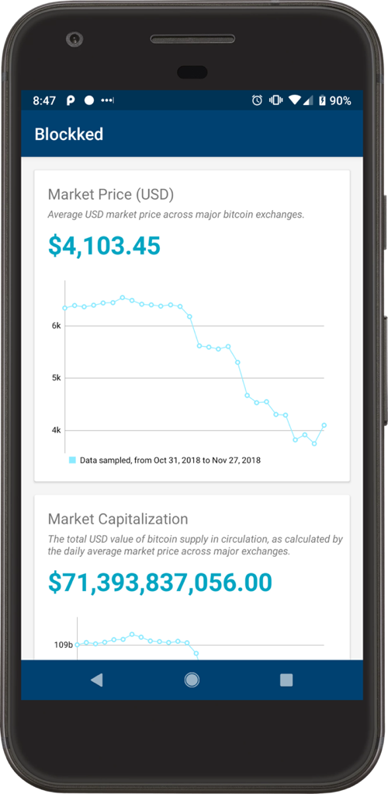

# BLOCKKED


> An Android companion for blockchain.info, written in Kotlin for demo purposes


## Overview

This project is a simple demo for retrieving some Blockchain.info data and presenting a simple dashboard with latest Bitcon prices.


We have support for both portrait and landscape modes. This app is HEAVILY tested, and I think that it is a showcase on how we can achieve great level of confidence based on good architectural decisions.

This project is 100% written in Kotlin.



## Knowledge Stack

This project leverages on

- RxJava2 for end-to-end reactive programming
- Kodein for Dependency Injection
- Kotlinx.Serialization for automatic JSON handling
- OkHttp3 + Retrofit for networking over HTTP
- Some custom libraries made by myself for testing
- Fancy DSLs
- Several tricks


## Building and Running

### Running from IDE

- Ensure you have Android Studio 3.2.1 or newer
- Is recommend to install Kotlinx.Serialization plugin on your IDE ([instructions](https://github.com/Kotlin/kotlinx.serialization))

### Building from CLI

To build run all unit tests and build a APK, execute

```
./gradlew build
```

### Running integration tests

To build run acceptance tests (Espresso), run

```
./gradlew connectedCheck
```

## Credits

Special thanks for 

- [Blockchain.com](https://blockchain.com) for the public Bitcoin API 
- [The Noun Project](https://thenounproject.com) for being such amazing service
- [Pablo Rosenberg](https://thenounproject.com/pabslabs) for the app icon


## LICENSE

```
The MIT License (MIT)

Copyright (c) 2018 Ubiratan Soares

Permission is hereby granted, free of charge, to any person obtaining a copy of
this software and associated documentation files (the "Software"), to deal in
the Software without restriction, including without limitation the rights to
use, copy, modify, merge, publish, distribute, sublicense, and/or sell copies of
the Software, and to permit persons to whom the Software is furnished to do so,
subject to the following conditions:

The above copyright notice and this permission notice shall be included in all
copies or substantial portions of the Software.

THE SOFTWARE IS PROVIDED "AS IS", WITHOUT WARRANTY OF ANY KIND, EXPRESS OR
IMPLIED, INCLUDING BUT NOT LIMITED TO THE WARRANTIES OF MERCHANTABILITY, FITNESS
FOR A PARTICULAR PURPOSE AND NONINFRINGEMENT. IN NO EVENT SHALL THE AUTHORS OR
COPYRIGHT HOLDERS BE LIABLE FOR ANY CLAIM, DAMAGES OR OTHER LIABILITY, WHETHER
IN AN ACTION OF CONTRACT, TORT OR OTHERWISE, ARISING FROM, OUT OF OR IN
CONNECTION WITH THE SOFTWARE OR THE USE OR OTHER DEALINGS IN THE SOFTWARE.
```